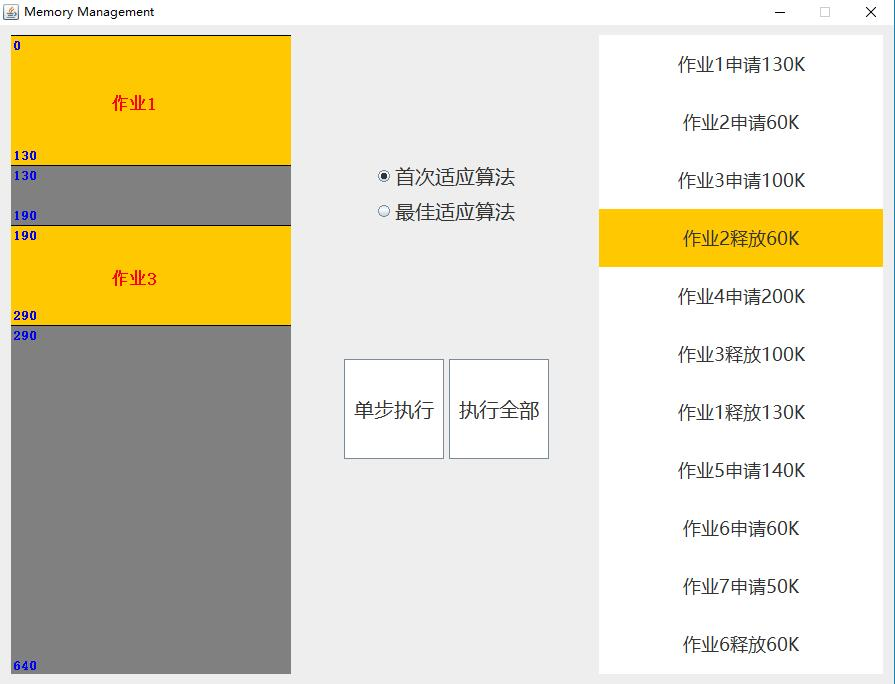
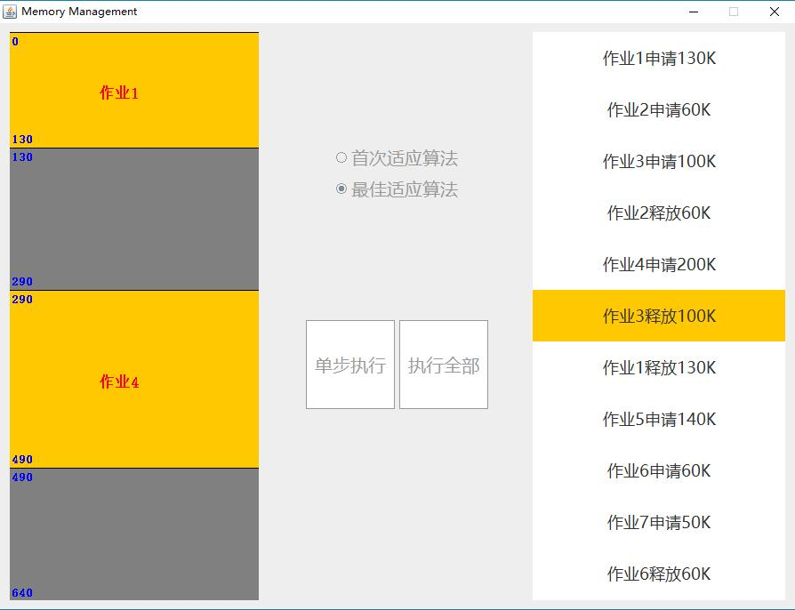

# 内存管理----动态分区分配

###### 操作系统第二次作业

### Author: 1753127 何立仁


## 项目介绍

### 1. 背景

- 内存管理----动态分区分配方式的模拟
- 初始内存空间为 `640K`，分别利用首次适应算法和最佳适应算法进行内存块的分配和回收

### 2. 开发和运行

- 使用 `java` 进行开发
- 运行 `java -jar App.jar` 即可


## 具体实现

### 1. 内存块

```java
class Zone {
    public int size;
    public int head;
    public int jobId;
    public boolean isFree;

    public Zone(int head, int size, int jobId) {
        this.head = head;
        this.size = size;
        this.jobId = jobId;
        this.isFree = true;
    }
}
```

内存块类包含变量：

- `size` ：内存块大小
- `head` ：内存块起始地址
- `jobId` ：使用该内存块的作业id
- `isFree` ：内存块当前是否被使用

### 2. 内存

```java
public class Memory {
	public static final int FirstFit = 0;
	public static final int BestFit = 1;
	// 内存大小为640K
	public static final int totalMemory = 640;
	
	public MemoryView view = new MemoryView(this);
	
	private int size;
    private LinkedList<Zone> zones;
    private int fitWay;

    public Memory() {
        this.size = totalMemory;
        this.zones = new LinkedList<>();
        zones.add(new Zone(0, size, 0));
        this.fitWay = FirstFit;
        view.paintCanvas();
    }
    ...
}
```

内存类包含变量：

- `size` ：内存大小
- `zones` ：内存块链表
- `fitWay` ：选择的适应算法

### 3. 首次适应算法

```java
private boolean fristFit(int size, int jobId) {
    int location = 0;
    // 遍历分区链表
    for (Zone zone : this.zones) {
        // 分配成功
        if (zone.isFree && (zone.size >= size)) {
            doAllocation(size, zone, jobId, location);
            return true;
        }
        ++location;
    }
    // 分配失败
    return false;
}
```

首次适应算法如下：

- 遍历分区链表，找到第一个大小大于等于所需大小的空闲分区
- 调用分配内存函数将该分区部分分配给该作业

### 4. 最佳适应算法

```java
private boolean bestFit(int size, int jobId) {
    int flag  = -1;
    int min = this.size + 1;
    Zone bestZone = null;
    int location = 0;
    // 遍历分区链表
    for (Zone zone : this.zones) {
        if (zone.isFree && (zone.size >= size)) {
            if (min > zone.size) {
                min = zone.size;
                bestZone = zone;
                flag = location;
            }
        }
        ++location;
    }
    // 是否成功分配
    if (flag != -1) {
        doAllocation(size, bestZone, jobId, flag);
        return true;
    } else {
        return false;
    }
}
```

最佳适应算法采用遍历分区链表，找到所有符合条件的空闲分区中最小的分区进行分配

### 5. 分配分区

```java
private void doAllocation(int size, Zone zone, int jobId, int location) {
    // 如果当前分区较大
    if (zone.size > size) {
        Zone split = new Zone(zone.head + size, zone.size - size, 0);
        this.zones.add(location + 1, split);
    }
    zone.size = size;
    zone.isFree = false;
    zone.jobId = jobId;
    // 界面画图
    view.paintCanvas();
}
```

将对应分区部分分配给相应作业，即当分配分区较打时将 **分区分割**

### 6. 回收内存

```java
public void collection(int jobId) {
    int location = 0;
    //遍历分区链表
    for (int i = 0; i < zones.size(); ++i) {
        Zone zone = zones.get(i);
        if (zone.jobId == jobId) {
            //如果回收分区不是尾分区且后一个分区为空闲, 则与后一个分区合并
            if (location < zones.size() - 1 && zones.get(location + 1).isFree){
                Zone next = zones.get(location + 1);
                zone.size += next.size;
                zones.remove(next);
            }
            //如果回收分区不是首分区且前一个分区为空闲, 则与前一个分区合并
            if (location > 0 && zones.get(location - 1).isFree) {
                Zone previous = zones.get(location - 1);
                previous.size += zone.size;
                zones.remove(zone);
                zone = previous;
            }
            zone.isFree = true;
            zone.jobId = 0;
            view.paintCanvas();
        }
        ++location;
    }
}
```

遍历分区链表找到作业占用的内存将其释放，并与其前后的 **空闲分区合并**


## 运行演示

### 1. 单步运行



### 2. 执行全部

